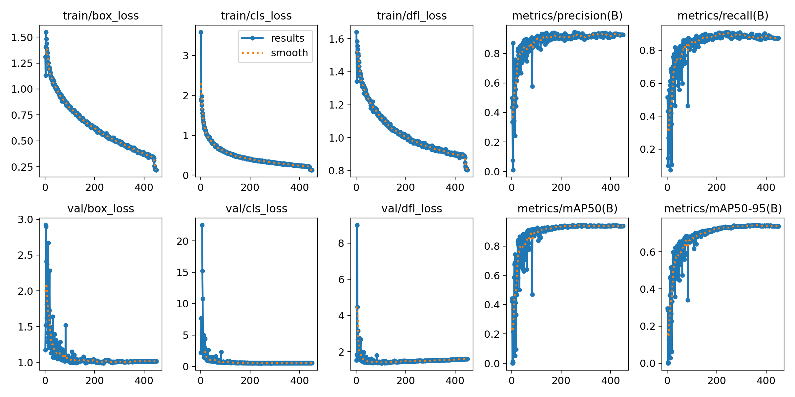
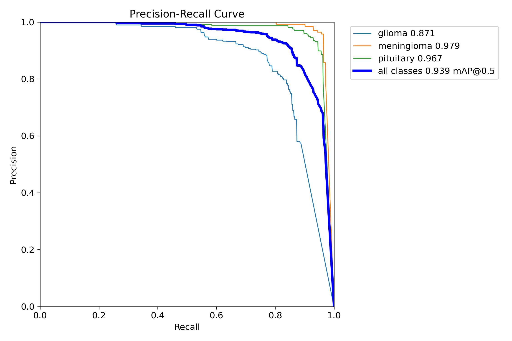
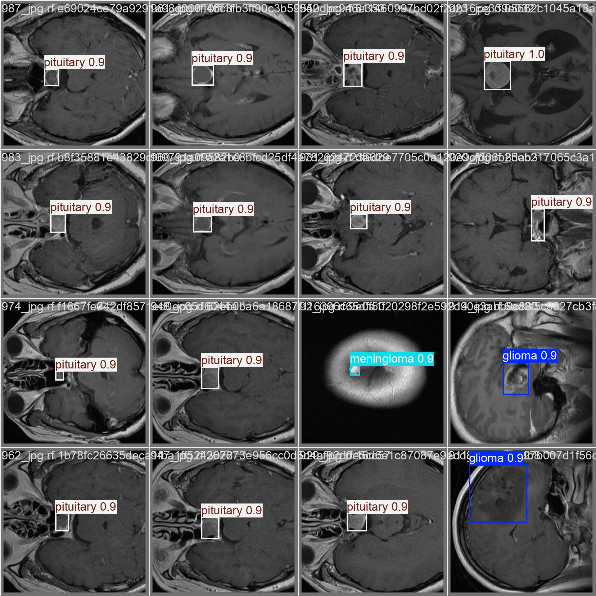

# 2025054711 - 基于大规模多尺度特征增强的脑瘤自动检测模型
An optimized training algorithm based on GCN， ResNet, FlashAttention, and Supervised Contrastive Learning

一个基于残差网络，快速注意力集中机制，自监督的对比学习的优化GCN模型算法

## Step 1: Fetch the code

```Bash
git clone https://github.com/RaF0721/enhanced-FaRnRYtrain.git && cd enhanced-FaRnRYtrain
```
Use the above command to pull the remote code to your local machine.

## Step 2: Fetch Code from Other Repos

```Bash
git clone https://github.com/sunsmarterjie/yolov12.git
```
The downloaded code should be placed directly in the project's root directory.

For example:
```Bash
./
├── docker/
│      └── ...
│    ...
│── SupContrast/
│      └── ...
│── ultralytics/
│      └── ...
│    ...
└── enhanced-ResNet.py
```

## Step 3: Set up a Python virtual environment

```Bash
python3 -m venv .venv && source .venv/bin/activate
```
**Note: Python version must be 3.10 or higher.**

For legacy systems, upgrade using:

    python -m pip install --upgrade python

## Step 3: Install Python dependencies

```Bash
pip3 install -r requirements.txt
```
**Note: Note: Please use the official PyPI mirror: https://pypi.org/simple**

Command-line Instruction Style:

    pip install --index-url https://pypi.org/simple package_name


## Step 4: Download and install the CUDA-enabled version of PyTorch

```Bash
pip3 install torch torchvision torchaudio --index-url https://download.pytorch.org/whl/cuxxx
```

**Note: Select the PyTorch version corresponding to your GPU's CUDA version**

Verify CUDA version before installation:

    nvcc --version
or:

    nvidia-smi

## Step 5: Download the flash_attn package and pretrained models

For example:

```Bash
wget https://github.com/Dao-AILab/flash-attention/releases/download/v2.7.3/flash_attn-2.7.3+cu11torch2.2cxx11abiFALSE-cp311-cp311-linux_x86_64.whl && pip install flash_attn-*.whl
```

**Note: Select the appropriate version according to your hardware and software environment**

## Step 6: Verify PyTorch and FlashAttention are functioning correctly

```python
import flash_attn, torch

print(torch.cuda.is_available())
print(flash_attn.__version__)
```
If no errors occur, congratulations! Your system is ready to use CUDA-enabled PyTorch and FlashAttention

## Step 7: Prepare Your Dataset

```Bash
# Dataset Structure

tree dataset -L 3

dataset/
├── images/
│   ├── train/
│   │   ├── image1.jpg
│   │   └── ...
│   └── val/
│       ├── image2.jpg
│       └── ...
└── labels/
    ├── train/
    │   ├── image1.txt
    │   └── ...
    └── val/
        ├── image2.txt
        └── ...

Label Format (per .txt file):
<class_id> <x_center> <y_center> <width> <height>  # Normalized (0-1)
```
Label.txt
```Bash
# Example label content:
0 0.4453125 0.634259 0.195312 0.240741
1 0.773438 0.251852 0.140625 0.388889
```

config.yaml
```Bash
# Dataset Config
path: ../dataset
train: images/train
val: images/val
names:
  0: person
  1: car
  2: traffic_light
```

## Step 8: Configure Training Parameters

Settings: Dataset path, learning rate, data augmentation, GPU devices, etc.

```yaml
# Example
train:
  data: ./config.yaml  # Path to your dataset
  epochs: 500
  batch: 64             # GPU memory permitting
  lr0: 0.01             # Initial learning rate
  augment: True         # Mosaic & MixUp
  device: 0             # GPU ID (0 for first GPU)
  workers: 8            # Data loading threads
...
val:
  split: val
  save_json: True
...
augment:  
  mosaic: 0.3         # 100% mosaic prob  
  mixup: 0.15         # MixUp ratio
  hsv_h: 0.015        # Hue augmentation
  flipud: 0.5         # Vertical flip 
```

## Step 9: Initiate Training

```Bash
python enhanced-ResNet.py
```

Expected Output:
```Bash
Epoch   gpu_mem       box_loss    cls_loss    dfl_loss
0/299     12.1G        2.354       1.732       1.543
1/299     12.1G        2.123       1.635       1.412
```

**Wait patiently for the training to complete. Upon finishing, the model will output evaluation metrics**
For example
```text
YOLOv12s summary (fused): 352 layers, 9,232,041 parameters, 0 gradients, 21.2 GFLOPs
                 Class     Images  Instances      Box(P          R      mAP50  mAP50-95): 100%|██████████| 21/21 [00:07<00:00,  2.67it/s]
                   all        612        612       0.88      0.905      0.931      0.694
                glioma        285        285      0.768      0.803      0.843      0.562
            meningioma        142        142      0.946      0.958      0.984      0.803
             pituitary        185        185      0.927      0.954      0.966      0.718
```

## Step 10: Evaluate and Deploy Your Trained Model

```bash
# Locate Model Artifacts
ls runs/detect/train/weights/
# best.pt       - Highest mAP weights
# last.pt       - Final epoch weights
```

**Quick Validation:**

```python
from models.yolo import Model
model = Model('runs/train/train/weights/best.pt')  # Load best model
results = model.val(data='dataset.yaml')  # Re-run validation
```

**A pre-configured validation program is available in the code. Run app.py and access https://localhost:8000 in your browser to immediately use the model.**
```Bash
pip install -r requirements.txt  
   # Includes:
   # fastapi>=0.95.0
   # uvicorn>=0.21.1
   # python-multipart (for file uploads)

python api.py
```

---

## Model Performance Visualization

### results.png



---

### PR_curve.png



---

### val_batch0_pred.jpg



---
